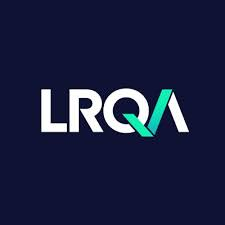

<b>LRQA</b> is a leading global assurance partner. They bring together unrivalled expertise in certification, brand assurance, cybersecurity, inspection and training.

LRQA has a rich heritage in assurance, having previously been part of Lloyds Register, and by combining strong values, decades of experience in risk management and mitigation and a keen focus on the future, LRQA's mission is to support clients in building a safer, more secure, more sustainable businesses.

From independent auditing, certification and training; to technical advisory services; to real-time assurance technology; to data-driven supply chain transformation, our innovative end-to-end solutions help our clients negotiate a rapidly changing risk landscape – making sure they’re shaping their own future, rather than letting it shape them.

Services you might be interested in could be ISO assessment such as Quality Management ISO9001, Information Security such as ISO27001 or Privacy ISO27701. LRQA also provide a suite of offensive and defensive cybersecurity services such as penetration testing, CISO consultancy and managed SOC services.

You can read about the full suite of LRQA services at [www.lrqa.com](www.lrqa.com). LRQA operate an internal employee referral scheme so if your interested in LRQA services (and want to support my work) I would appreciate it if you would let me connect you with the right people by dropping me a note below or emailing me at [seb_coles:outlook.com](mailto:seb_coles@outlook.com)!

<form
  action="https://formspree.io/f/mnqellgp"
  method="POST"
>
  <label>
    Your email:
    <input type="email" name="email">
  </label>
  <label>
    What LRQA services are you interested in?
    <textarea name="message"></textarea>
  </label>
  <!-- your other form fields go here -->
  <button type="submit">Send</button>
</form>

